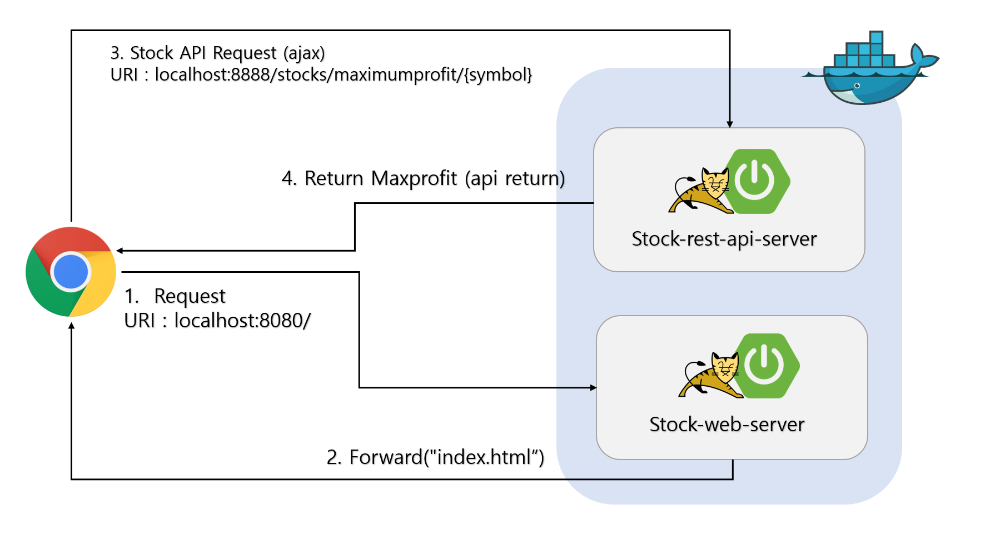
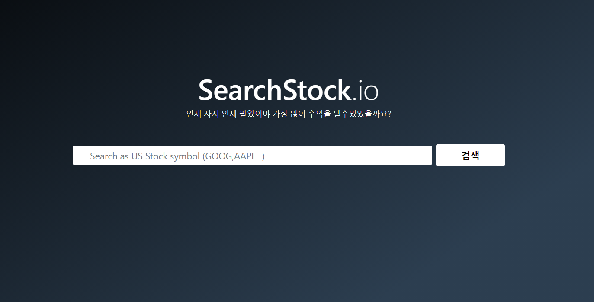
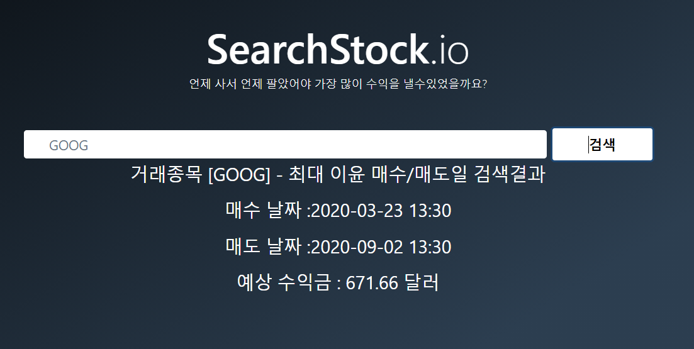
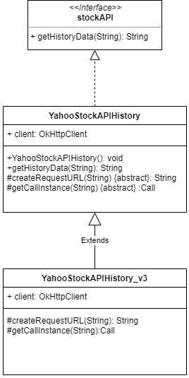
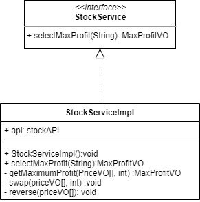
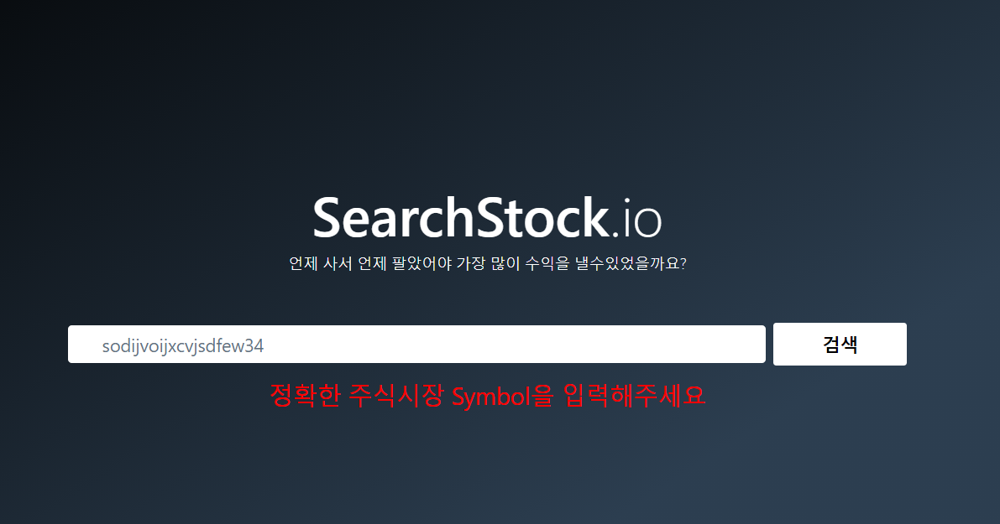

---
# [Stock Web Service](https://github.com/jaehyunup/stockWebService)
**개발이후 API key등의 요금관련된 민감한 부분을 제거하여 외부 API CALL이 되지않고,   
무분별한 사용을 막기위해 기존 첨부된 jar를 삭제하였습니다.**

---  
### 1. 개발환경
  - 기본 환경
    - IDE : Eclipse (Spring Tool Suite 4)
    - OS : Windows
    - Git
  - 웹서비스 개발환경
    - Java 11
    - Spring Boot 2.3.4
    - Maven
    - JUnit5
  - Dependency (REST API Server)
    - okhttp 2.7.5
    - gson 2.8.6
  - Dependency (Frontend)
    - bootstrap 4.5.2(webjars)
    - jquery 3.5.1(webjars)

### 2. 디렉토리 구조
디렉토리 구조는 다음과 같습니다.
```

(root)
|  README.md (readme file)
|  img (read me image dir)
|  src  (projects dir)
|   |__ stockRestAPI (spring boot project)
|   |__ stockWeb (spring boot project)
|  stockRestAPI-0.0.1-RELEASE.war
|  stockWeb-0.0.1-RELEASE.war 
```
디렉토리명|설명
---|---
README.md|설명 파일
img|readme에 첨부될 이미지들의 디렉토리
src| 프로젝트 디렉토리
src/stockRestAPI|주식 REST API 소스폴더
src/stockWeb| 주식 웹서비스 소스폴더


### 3. 빌드 및 실행 
  본 서비스는 주요 기능을 RESTAPI 화 하여 서비스하는 stockRestAPI와, 사용자에게 인터페이스를 제공하기위한 stockWeb 두개의 스프링부트 웹 서비스로 구성되어있습니다.
 
 **[주의] 서비스는 8080 , 8888 port를 같이 사용합니다.**

  #### - 방법 1. 빌드된 war 2개를 java를 통해 바로 실행하는 방법
  1. 루트 디렉토리에서 다음 명령어를 순차적으로 실행합니다.  
  ```bashshell
  /* REST API APP실행 */
  java -jar src/stockRestAPI/target/stockRestAPI-0.0.1-RELEASE.war
  ```
  ```bashshell
  /* web APP 실행 */
  java -jar src/stockWeb/target/stockWeb-0.0.1-RELEASE.war
  ```
  2. 두개의 서비스가 정상적으로 실행되었다면 브라우저를 열고, [localhost:8080](localhost:8080) 주소로 접속합니다.
  

  #### - 방법 2. 각 프로젝트 디렉토리 내의 dockerFile 을 이용하여 docker contrainer에서 실행하는 방법
  1. 이 방법은 docker가 install 되어있어야합니다.
  도커 install 가이드를 아래에 첨부하겠습니다.
    -[Docker install for Windows](https://docs.docker.com/docker-for-windows/install/)
    -[Docker install for linux](https://docs.docker.com/engine/install/ubuntu/)
    -[Docker install for Mac](https://docs.docker.com/docker-for-mac/install/)  
    <br>
  
  2. 이제 터미널 환경에서 /src/stockRestAPI 디렉토리로 이동하여 다음 명령어를 수행합니다.
  ```bashshell
  docker build -t stock-restapi-server .
  ```
  3. 다음으로 /src/stockWeb 디렉토리로 이동하여 아래 명령어를 수행합니다
  ```bashshell
  docker build -t stock-web-server .
  ```
  4. docker images 명령을 이용해 이미지로 올바르게 빌드되었는지 확인합니다.
  ```bashshell
  $ docker images
    REPOSITORY             TAG                 IMAGE ID            CREATED             SIZE
    stock-web-server       latest              ea9e63e2d1e5        41 minutes ago      647MB
    stock-restapi-server   latest              7fe9dc69aa6a        41 minutes ago      645MB
    openjdk                11                  6f56b78f4e05        2 weeks ago         627MB
  ```
  5. 아래 명령어를 통해 stock-restapi-server 이미지와 stock-web-server 이미지를 컨테이너에 마운트 합니다.
  ```bashshell
  docker run -p 8888:8888 stock-restapi-server
  ```
  ```bashshell
  docker run -p 8080:8080 stock-web-server
  ```
  
  6. 컨테이너 두개가 정상적으로 실행되고 있는지 확인하고, 정상 실행되고 있다면 브라우저를 통해 [localhost:8080](localhost:8080) 주소로 접속합니다.

### 4. 아키텍쳐


### 5. 서비스 사용방법
  1. 위의 실행과정을 거치고 localhost:8080 주소로 접속합니다.  

  

  2. 검색하고 싶은 US Stock Symbol을 입력하고 검색버튼을 클릭하면 거래종목에 대해 180일간의 최대 이윤이 발생하는 매수/매도 날짜와 예상 수익금을 보여줍니다.

  

---
# 개발과정  

프로젝트 요구사항을 분석하고, 소작업으로 분류하고 실제 코드로 구현하는 과정과 발생한 이슈를 어떻게 처리했고 어떤생각을 갖고 서비스를 구현하였는지 기록하였습니다.

---

## 1. 프로젝트 요구사항 분석
- ### 요구사항 분석
    ##### 기능 요구사항
    연번|요구사항명|비고
    ---|---|---
    F-01|최대 이익 매수/매도일 제공|시스템은 미국 주식 기호를 입력하면 지난 180일 동안 해당 주식 종목에서 발생한 거래데이터를 분석하여 최대 이익이 발생할 수 있었던 매수/매도일을 제공한다.
    F-02|웹 인터페이스| 사용자는 웹 인터페이스를 통해 시스템이 제공하는 서비스를 이용할 수 있다.
    
    ##### 비기능 요구사항
    연번|요구사항명|비고
    ---|---|---
    NF-01|알고리즘의 정확성|최대 이익이 발생하는 매수/매도일을 제공하기위한 알고리즘은 정확한 최대 이익을 반환해야한다.
    NF02|알고리즘의 효율성|매수/매도일을 도출하는 알고리즘은 효율적이여야 한다.
    NF03|명확한 추상화|API, 비즈니스, 데이터 계층 간 명확한 추상화를 제공해야한다.
    NF04|확장성|외부 데이터 소스는 쉽게 교환 될 수 있어야 한다
    NF05|재사용성| Component는 재사용이 가능해야한다.
    NF06|테스트 가능성| 여러가지 유스케이스 및 각 Component들에 대해 테스트가 가능하여야 한다.  

--- 
## 2.유스케이스를 수행하는데 필요한 컴포넌트별 책임 식별  
   우선, 사용자가 매수/매도일 반환을 요청할때의 전체적인 흐름을 확인해보기 위해 유스케이스를 작성해보았습니다.

   #### 사용자의 매수 / 매도일 반환 요청 유스케이스
   유스케이스 연번|이름|내용
   ---|---|---
   1| 사용자의 매수 / 매도일 반환 요청 | 사용자는 웹 인터페이스를 통해 종목코드(symbol)를 입력하고 최고이익 매수/매도일요청을 한다 
   2 | view 의 매수/매도일 반환 요청 | View에서 발생한 요청이 컨트롤러에 전달된다.
   3 | controller 의 service 요청 | 컨트롤러는 사용자가 입력한 symbol을 받아 서비스에게 매수/매도일 반환요청을 한다
   4 | service 는 매수/매도일을 구하기위해 stock api(DAO) 에 Data를 요청한다 | service의 매수/매도일을 구하는 비즈니스 로직이 실행되기 위해서는 DAO에서 제공하는 데이터(주식 데이터)가 필요하기 때문에, 이를 요청한다
   5 | DAO는 입력에 따른 데이터를 yahoo API에서 받아와 반환한다 |stock api(DAO) 는 야후 API에 symbol과 함께 데이터를 요청하고, 이를 service에게 다시 반환한다.
   6 | service 의 비즈니스로직 수행 | service는 매수/매도일을 계산하는 알고리즘을 수행하고, 매수/매도일 계산 결과를 controller에게 반환한다
   7 | controller가 사용자에게 결과를 보여준다| controller는 http 프로토콜에서 발생한 요청에 대한 응답으로 service가 수행된 결과를 반환하고 사용자에게 보여준다.
   <br> 

   #### 책임 요소 식별하기  
   구현 전, 유스케이스를 통해 식별된 각 컴포넌트들의 책임은 어떤것이 있을지 미리 정의하였습니다.
   이름|내용
   ---|---
   뷰 | 사용자에게 값을 입력받아, 행위에 따른 요청을 서버에게 전달하고, 서버에서 전달된 데이터를 사용자에게 보여주는 인터페이스의 책임을 가집니다.
   컨트롤러| 컨트롤러는 사용자에 다양한 요청에 대해 수행해야할 알맞은 서비스를 수행하고 이를 전달하는 뷰와 서비스 사이의 매개체의 책임을 가집니다.
   서비스 | 매수/매도일을 구하는 알고리즘을 수행하고 이를 controller 계층에 다시 반화하는 비즈니스 로직 수행의 책임만 가집니다. 따라서 서비스는 매수/매도일을 구하기 위해 필요한 데이터를 불러오는 메서드만 알고, 그 내부적인 수행 동작은 알필요도 없고 알아서는 안된다 생각했습니다.
   DAO(야후 주식 API 접근 객체) | DAO는 주식 데이터 반환 요청이 들어왔을때 Symbol을 가지고 야후 API를 Call하여 반환된 데이터를 온전하게 전달해주는 책임을 가집니다.  
---

## 3. 1차 구현
  ### 1. 데이터 계층(DAO) 구현 
- ### 해야할 일
    Yahoo finance API를 이용하여 데이터를 받아오고, 이 데이터를 DTO(VO)를 통해 반환하는 데이터 계층(DAO)의 구현

- ### 이슈 사항
  #### 이슈 1. 주식 정보를 어디서 어떻게 받아올것이고, 어떻게 구현할것인가?
    Yahoo 에서 제공하는 finance API 를 이용하여 데이터를 받아옵니다. 주식 정보를 API를 통해 받아오는 행위는 별도의 서비스라고 생각했고 웹서비스와 별도로 관리되어야만 주식 정보를 받아오는 로직에 변경이 생기더라도, 웹 서비스 전체에 영향이 없다 생각했습니다.  
    <br>
  #### 이슈 2. 변화에 대해 식별하고, 설계하기
    DAO에서, Data를 서비스계층으로 물려주는 행위는 변함이 없습니다. 하지만 이와 달리 DAO 객체에서 변화에 민감한 부분은 Yahoo API 요청을 위한 URI 생성, Request 객체 생성 로직이라 생각했습니다. 
    **만약 주식 데이터 API가 교체된다면?** API에게 요청을 할때의 URI와 Request에 담겨질 헤더가 변경될것입니다. 하지만 Response를 받았을때 이후로는 변경될 가능성이 낮다고 생각했습니다. 
    그래서 인터페이스를 통해 API가 할 행위를 추상화 하고, 상속을 통해 같은 API 별로 달라지는 URI,Request 헤더 변경에 대응할 수 있도록 하였습니다. 이렇게 구성하게된다면, 내부적으로 API를 변환하는 과정이 바뀌더라도 다른 계층에 영향을 주지 않을 수 있다 판단했습니다.

    ### - DAO 구현  
    - stockAPI.java
    ```java
    public interface stockAPI {
	/* api를 이용하여 Json 형태의 주식 데이터를 받아오는 행위 자체는 변함이 없습니다.
	 * 하지만 이 행위에 이용되는 API의 형태와, 그 형때에 따른 로직이 달라질 가능성도 있다고 생각했습니다.
	 * 따라서 인터페이스로 추상화하였습니다.
	 * */
	public String getHistoryData(String symbol) throws Exception;
    }
    ```

    - YahooStockAPIHistory.java
    ```java
    public abstract class YahooStockAPIHistory implements stockAPI{
        private Logger logger = LoggerFactory.getLogger(this.getClass());
        protected abstract String createRequestURL(String symbol) throws Exception;
        protected abstract Call getCallInstance(String symbol) throws Exception;
        protected OkHttpClient client;
        
        YahooStockAPIHistory(){
            client = new OkHttpClient();
        }
        
        @Override
        public String getHistoryData(String symbol) throws Exception {
            Response res=null;
            try {
                res = getCallInstance(symbol).execute();
                if(res.isSuccessful()) {
                    return res.body().string();
                }else {
                    logger.info("Yahoo API status가 정상이 아닙니다.");
                    return null;
                }
            } catch (IOException e) {
                e.printStackTrace();
            }
            return null;
        }
    }
    ```
    - YahooStockAPIHistory_v3.java
    ```java
    @Repository("stockapi")
    public class YahooStockAPIHistory_v3 extends YahooStockAPIHistory{
        private Logger logger = LoggerFactory.getLogger(this.getClass());
        @Override
        protected String createRequestURL(String symbol) throws NullPointerException {
            StringBuilder sb = new StringBuilder();
            sb.append("https://apidojo-yahoo-finance-v1.p.rapidapi.com/stock/v3/get-historical-data?"
                    + "region=US&symbol=").append(symbol);
            return sb.toString();
        }
        @Override
        protected Call getCallInstance(String symbol) throws Exception{
            Request request=null;
            try {
            request = new Request.Builder()
                    .url(this.createRequestURL(symbol))
                    .get()
                    .addHeader("x-rapidapi-host", "my-host-name")
                    .addHeader("x-rapidapi-key", "my-api-key")
                    .build();
            }catch(NullPointerException e) {
                logger.info("API 요청을 위한 매개변수가 부족합니다.");
            }
            return client.newCall(request);
        }
    }
    ```

    ### - DAO 계층 설계 UML
    - 결과적으로 구현된 DAO 계층의 구조는 다음과같습니다.<br>
    

    ### - DAO TEST CASE
    - ##### API 호출 TEST CASE (status check)  
        DAO 객체를 이용해 yahoo API에 주식가격 정보를 요청하고 status code를 확인한다.  

        ```java
        /* src/test/java/MaximumStock/DAO/MaximumStockApiResponseTest */
        /* [API DAO단에서 status code 가 정상적으로(200~300) 나오는지 확인하는 test]*/
        public class MaximumStockApiResponseTest {
            @Test
            @DisplayName("[API DAO ( Call ) unit test")
            void API_Service_Unit_Test_By_yahooAPI_history_v3(){
                // given : API 요청을 위한 과정
                stockAPI stockapi=new MockYahooStockApiHistory_v3();
                // when : 테스트 코드 동작
                String msg=stockapi.getHistoryData("GOOG");
                // then : 반환값 확인
                try {
                    assertNotNull(msg);
                }catch(AssertionError e) {
                    fail("status code is not succesfuly");
                    return;
                }
            }

            static class MockYahooStockApiHistory_v3 extends YahooStockAPIHistory_v3{

            }
        }
        ```  
    ___
### 2. 서비스 계층 구현 
- ### 해야할 일
    Data 계층의 데이터를 이용하여, 최대이윤 매수/매도일을 계산하고 반환하는 기능 구현이 필요.

- ### 이슈 사항
  #### 이슈 1. 받아온 데이터를 어떻게 일관성있게 Controller 계층에 전달할 것인가?
    일관성있는 반환 결과를 위해 MaxProfixVO 라는 VO 객체를 통해 반환하기로 결정했습니다.  
    <br>
    **- 생성된 MaxProfixVO**
    - MaxProfitVO.java
    ```java
    public class MaxProfitVO {
        Date minDate;
        Date maxDate;
        double profit;
        /* getter,setter,toString,생성자 생략하였습니다. */
    }
    ```
    
  #### 이슈 2. 서비스 비즈니스 로직의 변경이 Controller 계층에 영향이 가지 않으려면 어떻게 해야할 것인가?
    Interface를 통해 추상화한다면, Controller 계층은 서비스계층의 구현에 대해 알 필요가 없어질 것이라 생각했습니다.
    <br>

  #### 이슈 3. Data에서 넘어온 데이터를 어떻게 일관성있게 받을것인가?
    Yahoo API는 stock data를 다음과 같은 형태로 응답합니다.  

    ```json
    /* @example YapooFinace API call response.json */
    {"prices":
        [
            {
                "date":1600891201,
                "open":1458.780029296875,
                "high":1460.260009765625,
                "low":1407.699951171875,
                "close":1415.2099609375,
                "volume":1615935,
                "adjclose":1415.2099609375
            },
            {"date":1600781400,"open":1450.0899658203125,"high":1469.52001953125,"low":1434.530029296875,"close":1465.4599609375,"volume":1581300,"adjclose":1465.4599609375},
            {"date":1600435800,"open":1498.010009765625,"high":1503.0030517578125,"low":1437.1300048828125,"close":1459.989990234375,"volume":3103900,"adjclose":1459.989990234375}
        ],
    "isPending":false,
    "firstTradeDate":1092922200,
    "id":"",
    "timeZone":{"gmtOffset":-14400},
    "eventsData":[]}
    ```
    사실 해당 API의 Document 가 제공 되지않고, 단순히 앤드포인트 테스팅 형식으로 제공하고 있어서 사용하는데 꽤나 애를 먹었지만, 반환되는 result는 다행히도 해석하기 쉽게 제공해주고 있었습니다.<br>  
    **-API 명세가 없으니 직접 만들기**
    param|내용|type
    ---|---|---
    prices|과거 300일 동안의 stock 정보를 얻어옵니다|jsonArray
    date|거래일 날짜|Integer
    open|시작가|Fraction
    high|최고가|Fraction
    low|최저가|Fraction
    close|종가|Fraction
    volume|거래량|Integer
    adjclose|조정종가|Fraction

    이 명세에 따라, Gson library를 이용하여 매핑할 수 있는 VO 를 생성하고, HistoryVO 내부 멤버로 각 price(Json Object)를 담을 수 있는 priceVO[] 를 구성하여 Gson이 맵핑할 수 있게 하면 좋을것이라 생각했습니다. 

    ```java
    package com.jaehyun.stockWeb.MaximumStock.VO;
    public class HistoryVO {
        private priceVO[] prices;
        public priceVO[] getPrices() {
            return prices;
        }
        public void setPrices(priceVO[] prices) {
            this.prices = prices;
        }
        @Override
        public String toString() {
            return "HistoryVO [prices=" + Arrays.toString(prices) + "]";
        }
    }
    ```
        
    ```java
    package com.jaehyun.stockWeb.MaximumStock.VO;
    public class priceVO {
        private long date;
        private double open;
        private double high;
        private double low;
        private double close;
        private long volume;
        private double adjclose;
        // getter 생략
        // setter 생략
        // toString 생략
    }
    ```
    위와같이 서비스에서 DAO계층에 요청한 json 데이터를 받으면, Gson 을 이용하여 json을 HistoryVO로 매핑해서 HistoryVO의 멤버인 prices[] 내부값에 데이터들이 매핑되어지게 구현하면 될것이라 생각했습니다.

  #### 이슈 4. 매수/매도일을 구하는 알고리즘은 어떻게 구현할 것인가?
    최적의 매수 매도일을 계산하려면 어떻게 해야할지 생각해보았습니다  
     **- 초기에 도출된 방법 :180일간 가능한 모든쌍을 비교한다**
     가장 단순하지만 항상 O(n^2)의 시간복잡도를 가지기 때문에 효율적이지는 않다고 생각 했습니다. 
     
     **- 발전된 방법 : 판매는 항상 구매 다음날 이루어진다는 정보를 이용하여, Array의 length만큼 단 한번 돌며 전의 값 및 최대 이익과 비교하고 갱신하고, 최대 이익을 남길 수 있는 경우를 반환하게 한다.**  
     이 방법으로는 시간복잡도는 O(N)을 기대할 수 있을 것이고 효율적일거라 생각하여 이 방법을 선택하였습니다. 
    <br>
    ### - SERVICE 계층 설계 UML
    - 결과적으로 구현된 SERVICE 계층의 구조는 다음과같습니다.<br>
     
    <br>  

    ### - Service 구현  

    - stockService.java
    ```java
    package com.jaehyun.stockWeb.stock.Service;
    public interface StockService {
        /* 최대 이득 매도,매수일 알고리즘을 구현한다 */
        public MaxProfitVO selectMaxProfit(String symbol) throws Exception;
    }
    ```
    <br>
    
    - stockServiceImpl.java
    ```java
    package com.jaehyun.stockWeb.stock.Service;
    @Service("stockService")
    public class StockServiceImpl implements StockService {
        /*비즈니스을 정의한다, 즉 서비스 레이어의 책임은 모델 레이어의 데이터를 프레젠테이션 계층에
        적절하게 보여주기 위한 일련의 로직들의 구현에 관한 책임을 가진다. */
        @Autowired
        private stockAPI api;
        
        public StockServiceImpl(){
            api=new YahooStockAPIHistory_v3();
        }
        
        /* @Params String symbol - 조회할 주식의 Symbol
        * @Return MaxProfitVO - 해당 주식에 대해 180일간의 데이터에 대해 최대이윤 매수/매도일 및 수익을 return 한다.  
        * 
        * */
        @Override
        public MaxProfitVO selectMaxProfit(String symbol) throws Exception {
            String resultJsonString=null;
            priceVO[] priceList=null;
            try {
                resultJsonString=api.getHistoryData(symbol);
                Gson gson=new Gson();
                HistoryVO history = gson.fromJson(resultJsonString, HistoryVO.class);
                priceList=history.getPrices();
            }catch(NullPointerException e) {
                e.printStackTrace();
            }
            return getMaximumProfit(priceList,180);
        }
        
        /*
        * @Params priceVO[] priceVOList - 주식시장 가격정보 리스트
        * 		   int dayLength - 해당 일까지의 데이터만 연산하기 위함.
        * */
        MaxProfitVO getMaximumProfit(priceVO[] priceVOList,int dayLength) throws Exception{
            /* 야후 주식데이터는 최근값이 가장 앞에 오게 반환되어지기 때문에 반대로 변환한다. */        
            if(priceVOList.length < dayLength) {
                /*180 영업일만큼의 데이터가 없다면*/
                throw new Exception("Data가 dayLength보다 작습니다.");
            }
            // 180 영업일 기준으로 자르기
            priceVOList=Arrays.copyOfRange(priceVOList,0,dayLength);
            // 연산을위한 reverse
            reverse(priceVOList);
            int minIdx = 0, maxIdx = 0;
            double sell, buy, min, profit = 0;
            for (int i = 0; i < dayLength; i++) {
                if (priceVOList[i].getClose() < priceVOList[minIdx].getClose()) // 최소 갱신
                    minIdx = i;
                else if (priceVOList[i].getClose() - priceVOList[minIdx].getClose() > profit) {
                    buy = priceVOList[minIdx].getClose();
                    sell = priceVOList[i].getClose();
                    profit = priceVOList[i].getClose() - priceVOList[minIdx].getClose();
                    maxIdx = i;
                }
            }
            Date minDate = new java.util.Date(priceVOList[minIdx].getDate() * 1000L);
            Date maxDate = new java.util.Date(priceVOList[maxIdx].getDate() * 1000L);
            return new MaxProfitVO(minDate,maxDate,profit);
        }

        /*reverse에 필요한 swap*/
        void swap(priceVO[] pricevo, int idx1, int idx2) {
            priceVO t = pricevo[idx1];
            pricevo[idx1] =  pricevo[idx2];
            pricevo[idx2] = t;
        }
        /* 배열 reverse */
        void reverse(priceVO[] pricevo) {
            for (int i = 0; i < pricevo.length / 2; i++) {
                swap(pricevo, i, pricevo.length - i - 1);
            }
        }
    }
    ```
    <br>  

    ### - Service TEST CASE

    - ##### Json Parsing 테스트 케이스
      Data 계층에 요청한 Json Data를 Gson을 이용해 상기 명시했던 HistoryVO에 맵핑하고, 맵핑이 잘 되었는지 확인할 수 있는 테스트 케이스
        ```java
        class MaximumStockJsonParsingTest {
	        @Test
	        @DisplayName("Json을 HistoryVO에 맵핑하여 prices가 Object 배열로 모두 잘 반환되는지")
	        void Json_To_Object_Array_MappingBy_Gson_isCollect_Test() {
		            String fakeJsonString=new FakeHistoryJson().getJson();
		            Gson gson=new Gson();
		            HistoryVO history = gson.fromJson(fakeJsonString, HistoryVO.class);
		            priceVO[] prices=history.getPrices();
		            assertTrue(prices.length > 200);
	        }
        }
        ```
    - ##### 최대이윤 매수/매도일 알고리즘 테스트 케이스
      서비스에서 수행해야할 최대이윤이 발생하는 매수/매도일 알고리즘을 테스트할 수 있는 테스트케이스
        ```java
        class MaximumPriceBuySell {
            @Test
            @DisplayName("알고리즘이 결과적으로 최소값과 최대값을 반환하는지 확인한다")
            void test() {
                assertTrue(checkTestCase1(new String[] {"3","8"},getMaximumPriceBuySell(new int[] {3,6,8,2,3})));
            }
            
            boolean checkTestCase1(String[] testAnswer,String[] result) {
                for (int i = 0; i < testAnswer.length; i++) {
                    if(!result[i].equals(testAnswer[i])) {
                        return false;
                    }
                }
                return true;
            }
            
            String[] getMaximumPriceBuySell(int arr[]) {
            /*  최대 이익 매수가격 : arr[buy] 
                최대 이익 매수가격 : arr[sell] 
                최대 이익 : profit              */
                int i = 0, buy = 0, sell = 0, min = 0, profit = 0;
                for (i = 0; i < arr.length; i++) {
                    if (arr[i] < arr[min])
                        min = i;
                    else if (arr[i] - arr[min] > profit) {
                        buy = min; 
                        sell = i;
                        profit = arr[i] - arr[min];
                    }
                }
                return new String[] {Integer.toString(arr[buy]),Integer.toString(arr[sell])};
            }
        }
        ```  
        <br>  

        **- 몇 가지 입력값과 결과분석을 통해 다시 고려해보기**
        케이스|입력값|예상값| 결과
        ---|---|---|---
        case 1|[3,6,8,2,3]| [3,6] | true
        case 2|[102,3,16,2,109,4,207]|[2,207]|true
        case 3|[7,102,2,105,1,7,5,63]|[2,105]|true
        case 4|[2,2,2,2,2]|[2,2]|true

        테스트케이스 검증을 통해, 180일간 가장 최근에 나온 최대 profit 을 가지는 sell/but 가격을 return 하는 메서드를 구현하였습니다. 시간복잡도는 O(N) 으로 완전탐색에 비해 효율적이라 생각하였습니다. 그래서 이 로직을 사용헀습니다.
            
    - ##### 서비스 최대이윤 매수/매도일 반환 테스트케이스
      위 테스트 케이스에서 더 확장하여, 서비스에서 수행해야할 최대이윤이 발생하는 매수/매도일 을 잘 반환하는지 테스트할 수 있는 테스트케이스    
        ##### 고려한 사항
            1 . 확장될 테스트케이스는 Service layer 에 해당하는 테스트케이스라는것을 알고 이를 고려하여야 한다.
            2. 현재처럼 String[] 형으로 넘겨준다면 변화가 일어났을때 프레젠테이션 계층에 영향을 끼칠 수 있기 때문에, 프레젠테이션 계층과 서비스 계층 간 VO 객체를 만들어 의존성을 제거한다.
        ```java
        class MaximumStockService_getMaximumTest {
        @Test
        @DisplayName("서비스에서 최대이윤을 남길 수 있는 매수/매도일을 MaxProfix에 잘 반환하는지")
        void MaximumStockService_getMaximumTest() {
                //even 전처리, 가짜 Json을 주입한다
                String fakeJsonString = new FakeHistoryJson().getJson();
                Gson gson = new Gson();
                HistoryVO history = gson.fromJson(fakeJsonString, HistoryVO.class);
                priceVO[] prices = history.getPrices();
                // when 로직동작(서비스내부 로직을 테스트)
                MaxProfitVO result = getMaximumProfit(prices);
                assertTrue(result.getMinDate().toString().equals("Mon Mar 23 22:30:00 KST 2020"));
                assertTrue(result.getMaxDate().toString().equals("Wed Sep 02 22:30:00 KST 2020"));
            }
            /*
                @Param priceVOList
                @retun MaxProfixVO
                @description - priceVOList(날짜별 주식 가격)를 탐색하여 최저/최고 매수가 및 금액을 가진 MaxProfitVO 인스턴스를 생성하고 return
            */
            MaxProfitVO getMaximumProfit(priceVO[] priceVOList) {
                /* yahoo API DATA는 최근값이 Object의 가장 마지막에 있기 떄문에 
                reverse 연산이 필요함  */
                reverse(priceVOList);
                
                /* 최저 매수, 최고 매도가를 구하는 로직 */
                int minIdx = 0, maxIdx = 0;
                double sell, buy, min, profit = 0;
                for (int i = 0; i < priceVOList.length; i++) {
                    // f
                    if (priceVOList[i].getClose() < priceVOList[minIdx].getClose()) // 최소 갱신
                        minIdx = i;
                    else if (priceVOList[i].getClose() - priceVOList[minIdx].getClose() > profit) {
                        buy = priceVOList[minIdx].getClose();
                        sell = priceVOList[i].getClose();
                        profit = priceVOList[i].getClose() - priceVOList[minIdx].getClose();
                        maxIdx = i;
                    }
                }
        /*		@priceVOList[minIdx].getClose() -  최저 매수가 
                @priceVOList[maxIdx].getClose() - 최고 매도가
                @profit - 거래에서 발생할 수 있는 이익 :            */
                Date minDate = new java.util.Date(priceVOList[minIdx].getDate() * 1000L);
                Date maxDate = new java.util.Date(priceVOList[maxIdx].getDate() * 1000L);
                return new MaxProfitVO(minDate,maxDate,profit);
            }
            /*reverse에 필요한 swap*/
            void swap(priceVO[] pricevo, int idx1, int idx2) {
                priceVO t = pricevo[idx1];
                pricevo[idx1] =  pricevo[idx2];
                pricevo[idx2] = t;
            }
            /* 배열 reverse */
            void reverse(priceVO[] pricevo) {
                for (int i = 0; i < pricevo.length / 2; i++) {
                    swap(pricevo, i, pricevo.length - i - 1);
                }
            }
        }
        ```
    ___

### 3. 컨트롤러 계층 구현
- ### 해야할 일
    사용자에 요청을 받아들이고, 이를 서비스에 전달하여 반환값을 다시 사용자에게 전달해주는 컨트롤러의 구현

- ### 이슈 사항
  #### 이슈 1. View에서 어떤 방식으로 요청했을때 동작할것인가?
    view에서 "/getMaximumProfit" URI에 POST 요청으로 Request 했을때 최대이윤 매수/매도일 서비스가 실행되어야한다 생각했습니다. 따라서 Spring이 제공하는 RequestMapping 어노테이션을 이용해 해당 URI에 대한 메서드를 실행할 수 있게끔 맵핑 해주면 된다고 생각했습니다.
    ```java
     @RequestMapping(value="/getMaximumProfit", method=RequestMethod.POST)
    public String selectMaxProfit(HttpServletRequest request,HttpServletResponse res) {
        
    } 
    ```
  #### 이슈 2. 반환값을 어떻게 View에게 전달할 것인가?
    현재 서비스에서 View는 JSP로 구성되어있고, 서비스 요청이 들어왔을때 정상적으로 서비스가 수행되었다면 결과를 파라미터에 담아 MaximumProfit.jsp View로 forward 해서, view단에서 JSP 를통해 이 데이터들을 사용자에게 뿌려줄 수 있을 것이라 생각했습니다.
  #### 이슈 2. 사용자의 잘못된 Symbol 입력은 어떻게 처리할것인가?
    사용자가  GOOG 이라고 정확히 입력하지 않고, 'goog' 라던가 'gool' 을 입력할때 발생 할 수 있는 위험요소는 두가지였습니다.  소문자를 입력하는것에 대해서는 symbol에 대해 uppercase로 변환하면 되지만, 미국 주식시장에 존재하지 않는 Symbol이 입력 된다면 service는 호출되면 안된다고 생각합니다. 제가 생각하기에 이에 대처하는 가장 좋은방법은 View단에서 요청을 보내기 전, 유효성 검증을 하는것이라 생각합니다. 하지만 본 프로젝트 목표가 프론트앤드 중심이 아니기 때문에.. 우선은 위험요소를 식별한 상태에서 잠시 머물기로 결정했습니다.
    

    ### - Controller 구현  

    ```java
    @Controller("stockController")
    public class StockController {
        private Logger logger = LoggerFactory.getLogger(this.getClass());
        @Resource(name="stockService")
        StockService stockService;
        @RequestMapping(value="/getMaximumProfit", method=RequestMethod.POST)
        public String selectMaxProfit(HttpServletRequest httpServletRequest,Model model) {
            String symbol =httpServletRequest.getParameter("symbol").toUpperCase();
            try {
                model.addAttribute("MaxProfitVO",stockService.selectMaxProfit(symbol));
            } catch (Exception e) {
                logger.info("stock service 에러발생");
                model.addAttribute("serachStatus","notFound");
                return "index";
            }
            return "MaximumProfit";
        }
    }
    ```
    ### - Controller TEST CASE

    - ##### Json Parsing 테스트 케이스
      Data 계층에 요청한 Json Data를 Gson을 이용해 상기 명시했던 HistoryVO에 맵핑하고, 맵핑이 잘 되었는지 확인할 수 있는 테스트 케이스

      ```java
      package com.jaehyun.stockWeb.MaximumStock.PresentationLayerTest;
      @WebMvcTest
      public class StockControllerTest {
          @Autowired
          private MockMvc mockMvc;

          @MockBean(name="stockService")
          private StockService stockService;
          
          @InjectMocks
          private StockController stockController;
          
          @Test
          @DisplayName("StockController가 view-service간 적절한 값을 주고받고 있는지")
          public void StockController_Unit_Test() throws Exception {
              String minDate="Mon Mar 23 22:30:00 KST 2020";
              String MaxDate="Wed Sep 02 22:30:00 KST 2020";
              SimpleDateFormat dateFormat = new SimpleDateFormat("E MMM dd HH:mm:ss z yyyy", Locale.ENGLISH);
              MaxProfitVO testVO=new MaxProfitVO(dateFormat.parse(minDate),dateFormat.parse(MaxDate), 100);
              when(stockService.selectMaxProfit("GOOG")).thenReturn(testVO);
              /*Mock Service인 stockService는 selectMaxProfit("GOOG")메소드에 대한 요청에 testVO를 리턴한다.*/
              
              /*파라미터 셋팅*/
              MultiValueMap<String, String> paramsMap = new LinkedMultiValueMap<>();
              paramsMap.set("symbol","GOOG");
              /*mockMvc 객체를 통해 Post요청으로, GOOG 심볼을 담아서 보내고, status와 model 객체에 
              * MaxProfitVO key를 가진 Attribute가 있는지 확인하고, 결과를 print한다.*/
              mockMvc.perform(post("/getMaximumProfit")
                  .contentType(MediaType.APPLICATION_FORM_URLENCODED_VALUE)
                  .params(paramsMap))
                  .andExpect(status().isOk())
                  .andExpect(model().attributeExists("MaxProfitVO"))
                  .andDo(print());
          }
      }

      ```
    ___
### 4. 뷰 계층 구현
- ### 해야할 일
    사용자에게 제공될 웹 인터페이스를 구현한다.

- ### 이슈 사항
  #### 이슈 1. View는 어떻게 구현될 것인가?
  View가 할 행위에서 식별된것은 두가지였습니다. 
  - 사용자의 입력을 받을 페이지 (index.jsp)
    책임 - POST 요청과 함께 parameter가 들어오면 이를 서비스에 전달하기, 잘못된 요청이라면 사용자에게 알려주기.
  - 사용자에게 결과를 출력할 페이지 (getMaximumProfit.jsp)
    책임 - 서비스에 요청한 결과를 받아서 parameter를 JSP로 만들어진 View의 적절한 위치에 삽입하기.  

- ### View 구현  
    - index.jsp
    ```html
    
    <!-- 생략 --> 
    <%
    String searchStatus=(String)request.getAttribute("serachStatus");  
    if(searchStatus!=null) pageContext.setAttribute("serachStatus", searchStatus) ;
    %>
    <form class="form-row align-items-center" method="POST" name="maximumProfitForm" action="getMaximumProfit">
    	<div class="col-md-11 mt-5">
      			<%if(searchStatus!=null && searchStatus.equals("notFound")){ %>
      			<label for="symbol">US 주식종목의 심볼을 정확히 입력하세요.</label>
      			<%} %>
      			<input class="form-control <%=searchStatus%>"
      			 	type="text" id="symbol" name="symbol" 
      			 	placeholder="Search as US Stock symbol (GOOG,AAPL...)" />
      		</div>
 			<div class="col-md-1">
 				<input class="btn" type="submit" value="검색" required>
 			</div>			 
 	</form>    
     <!-- 생략 --> 
    ```
    위와 같은 폼태그 구현을 통해, 사용자가 post 요청으로 컨트롤러에게 요청하게끔 구현하였습니다.
    <br>
    - getMaximumProfit.jsp
    ```html
    <!-- 생략 --> 
    <%
    /* Date Time 변경 및 수익 소숫점 자르기 */
    MaxProfitVO maxProfitVO=(MaxProfitVO)request.getAttribute("MaxProfitVO");
	Instant minDateInstant=maxProfitVO.getMinDate().toInstant();
	Instant maxDateInstant=maxProfitVO.getMaxDate().toInstant();
	DateTimeFormatter DATE_TIME_FORMATTER=DateTimeFormatter.ofPattern("yyyy-MM-dd").withZone(ZoneId.of("America/New_York"));
	String minDate_UTC=DATE_TIME_FORMATTER.format(minDateInstant);
	String maxDate_UTC=DATE_TIME_FORMATTER.format(maxDateInstant);
	DecimalFormat df = new DecimalFormat("0.##");
	String profitRounded = df.format(maxProfitVO.getProfit()); 
    %>
    <div id="cover">        
        <div class="jumbotron jumbotron-fluid">
            <div class="container HeaderCon">
                <h1 class="title display-3 text-center" style="font-weight:100;"><strong style="font-weight:600;">SearchStock</strong>.io</h1>
		        <p class="lead string-1 text-center">언제 사서 언제 팔았어야 가장 많이 수익을 낼수있었을까요?</p>	     
	            <div class=row>
	  	  	        <div class="col-md-12"><p>매수 날짜 : <%=minDate_UTC%></p></div>
	  	  	        <div class="col-md-12"><p>매도 날짜 : <%=maxDate_UTC%></p></div>
	  	  	        <div class="col-md-12"><p>수익 : <%=profitRounded%> US Dollar</p></div>
  	  	        <input class="btn btn-rounded" type="button" value="돌아가기" onClick="location.href='/'">
            </div>
            </div>
        </div>  
    </div>
    <!-- 생략 --> 
    ```
    이렇게 최적매수, 매도날짜와 수익을 사용자에게 제공해주게 됩니다.
    다음으로는 1차 구현이 끝난 상태에서, 더 좋은 방법은 없을지 리팩토링을 시도해보았습니다.

---
## 4. 기능 구현을 확인하고, 리팩토링 시도
 만들어진 웹 서비스가 지금보다 더 좋은 방법으로 구성할수 있는지 생각해보고, 서비스 기능이 더 확장될때 어떻게 대처할 수 있을지 확인해보는 과정을 거치려고합니다.
    
- ### 먼저 요구사항이 모두 구현되었는지 확인하기.
    - ##### 기능적 요구사항
    연번|요구사항명|비고|구현 여부
    ---|---|---|---
    F-01|최대 이익 매수/매도일 제공|시스템은 미국 주식 기호를 입력하면 지난 180일 동안 해당 주식 종목에서 발생한 거래데이터를 분석하여 최대 이익이 발생할 수 있었던 매수/매도일을 제공한다.|O
    F-02|웹 인터페이스| 사용자는 웹 인터페이스를 통해 시스템이 제공하는 서비스를 이용할 수 있다.|O
    
    <br>

    - ##### 비기능적 요구사항
    연번|요구사항명|비고|충족 여부
    ---|---|---|---
    NF-01|알고리즘의 정확성|최대 이익이 발생하는 매수/매도일을 제공하기위한 알고리즘은 정확한 최대 이익을 반환해야한다.| 알고리즘은 최대이윤을 발생시키는 매도/매수일을 반환하고 있습니다.
    NF02|알고리즘의 효율성|매수/매도일을 도출하는 알고리즘은 효율적이여야 한다.| 알고리즘 구현 간 시간복잡도를 고려하여 작성하였습니다.
    NF03|명확한 추상화|API, 비즈니스, 데이터 계층 간 명확한 추상화를 제공해야한다.|구현중 각 계층 간 책임을 식별하고 낮은 의존도를 고려하여 구현하였습니다.
    NF04|확장성|외부 데이터 소스는 쉽게 교환 될 수 있어야 한다.| API 변경에 대비하여 인터페이스,상속등을 이용하여 코드를 작성하였습니다.
    NF05|재사용성| Component는 재사용이 가능해야한다.|각 계층을 인터페이스로 추상화하여 모듈화 하였습니다.
    NF06|테스트 가능성| 여러가지 유스케이스 및 각 Component들에 대해 테스트가 가능하여야 한다.| 계층별 테스트 케이스를 통해 각각의 계층이 잘 동작하고있는지 확인할 수 있는 테스트 코드를 작성하였습니다.
<br>  

- ### 웹 애플리케이션과 주식 서비스를 분리하자!
    지금은 웹 애플리케이션 내부적으로 최소/최대값을 반환하는 서비스가 구현되어있지만, 최소/최대값을 반환하는 서비스를 웹 애플리케이션과 분리하여 REST API 형태로 구현하고, 분리하는것이 더 좋을것이라고 생각합니다.  
    그렇게 구현한다면 현재 뷰 - 컨트롤러간 의존성을 완전히 제거할 수 있다고 생각했습니다.
    추후 별개로 다른 서비스를 개발하면서 주식 서비스의 기능이 필요하게 된다면 단순히 주식 REST API 서버에 서비스를 요청하고 API 명세에 따라 반환된 데이터를 이용만 하면 될것이라 생각했습니다. 
    그래서 웹 애플리케이션의 행위는 사용자와의 인터페이스역할을 하고 별도의 REST API를 구성하여 웹 애플리케이션이 필요할때 정보를 요청할 수 있게끔 변화시켰습니다.
---

## 5. 2차구현 (서비스를 REST API로 분리하기)
 리팩토링을 어떻게할지 생각해보면서 웹 애플리케이션과 주식서비스를 분리해야한다는 결론이 나왔고, 이를 수행하는 2차구현 과정입니다.
 ### 1. 주식 서비스를 REST API로 분리하기
- ### 해야할 일
    기존 웹 애플리케이션 한개에 모두 구성되어있던 최대이윤 매도/매수를 구성하는 기능을 별도의 REST API로 분리하기.
- ### 이슈 사항
  #### 이슈 1. REST API로 어떻게 분리시킬것인가?  
    Spring 에서 RestController를 이용해 요청에 대해 Json 형태로 최대이윤 매수/매도 식별 결과를 Return 할 수 있게 하면 될것이라 생각했습니다.  
    <br>  

  #### 이슈 2. 기존 View 페이지는 어떻게 변경될것인가?
    기존에는 메인 웹 애플리케이션에 구현된 Controller를 통해 주식 서비스의 결과를 반환해주었지만, 이제 주식서비스가 REST API로 분리되었으니 View단에서 ajax를 이용해 결과를 받아보는 형태로 변화하면 될것이라 생각했습니다.


- ### REST API 구현
  별도의 Spring boot 환경을 구성하고, stock REST API 기능을 구현하였습니다.

  #### 1. 컨트롤러 구현
  - stockController.java
    ```java
    package com.jaehyun.stockRESTful.stock.controller;
    import com.jaehyun.stockRESTful.stock.VO.MaxProfitVO;

    @RestController
    @RequestMapping("/stocks")
    public class StockController {
        private Logger logger = LoggerFactory.getLogger(this.getClass());
        
        @Resource(name="stockService")
        StockService stockService;
        
        @GetMapping("/maximumprofit/{symbol}")
        public ResponseEntity maximumprofit(@PathVariable String symbol) {
            try {
                MaxProfitVO result=stockService.selectMaxProfit(symbol);
                return new ResponseEntity<>(result,HttpStatus.OK);
            } catch (Exception e) {
                logger.info("stock service 예외발생");
                e.printStackTrace();
                return new ResponseEntity<>("Stock Symbol을 정확히 입력해주세요",HttpStatus.BAD_REQUEST);
            }
        }
    }
    ```
    - REST API의 정의에 맞게, 요청 URI또한 RESTful 하게 변환하려고 시도하였습니다. 
      

  #### 2. 데이터/서비스 계층 구현
  컨트롤러 동작에 필요한 데이터 계층과 서비스 계층은 기존 웹 애플리케이션에서 구현되었던 코드를 재사용 하였습니다.  

  #### 3. Date를 UTC 기준으로 변경하기위한 Service,VO에 약간의 수정 사항 
    - ##### MaxProfitVO.java
    ```java
    package com.jaehyun.stockRESTful.stock.VO;
    public class MaxProfitVO {
        String minDate; /* 자료형 java.util.Date -> String 변경 */
        String maxDate; /* 자료형 java.util.Date -> String 변경 */
        double profit;
        /*@Getter,Setter,toString,생성자 생략*/
    }
    ```  
    - ##### StockServiceImpl.java
    ```java
    package com.jaehyun.stockRESTful.stock.Service;
    @Service("stockService")
    public class StockServiceImpl implements StockService {
        /*비즈니스을 정의한다, 즉 서비스 레이어의 책임은 모델 레이어의 데이터를 프레젠테이션 계층에
        적절하게 보여주기 위한 일련의 로직들의 구현에 관한 책임을 가진다. */
        @Autowired
        private stockAPI api;
        
        public StockServiceImpl(){
            api=new YahooStockAPIHistory_v3();
        }
        
        /* @Params String symbol - 조회할 주식의 Symbol
        * @Return MaxProfitVO - 해당 주식에 대해 180일간의 데이터에 대해 최대이윤 매수/매도일 및 수익을 return 한다.  
        * 
        * */
        @Override
        public MaxProfitVO selectMaxProfit(String symbol) throws Exception {
            String resultJsonString=null;
            priceVO[] priceList=null;
            try {
                resultJsonString=api.getHistoryData(symbol);
                Gson gson=new Gson();
                HistoryVO history = gson.fromJson(resultJsonString, HistoryVO.class);
                priceList=history.getPrices();
            }catch(NullPointerException e) {
                e.printStackTrace();
            }
            return getMaximumProfit(priceList,180);
        }
        
        /*
        * @Params priceVO[] priceVOList - 주식시장 가격정보 리스트
        * 		   int dayLength - 해당 일까지의 데이터만 연산하기 위함.
        * */
        MaxProfitVO getMaximumProfit(priceVO[] priceVOList,int dayLength) throws Exception{
            /* 야후 주식데이터는 최근값이 가장 앞에 오게 반환되어지기 때문에 반대로 변환한다. */
            
            if(priceVOList.length < dayLength) {
                /*180 영업일만큼의 데이터가 없다면*/
                throw new Exception("Data가 dayLength보다 작습니다.");
            }
            // 180 영업일 기준으로 자르기
            priceVOList=Arrays.copyOfRange(priceVOList,0,dayLength);
            // 연산을위한 reverse
            reverse(priceVOList);
            
            int minIdx = 0, maxIdx = 0;
            double sell, buy, min, profit = 0;
            for (int i = 0; i < dayLength; i++) {
                // f
                if (priceVOList[i].getClose() < priceVOList[minIdx].getClose()) // 최소 갱신
                    minIdx = i;
                else if (priceVOList[i].getClose() - priceVOList[minIdx].getClose() > profit) {
                    buy = priceVOList[minIdx].getClose();
                    sell = priceVOList[i].getClose();
                    profit = priceVOList[i].getClose() - priceVOList[minIdx].getClose();
                    maxIdx = i;
                }
            }
            Date minDate = new Date(priceVOList[minIdx].getDate() * 1000L);
            Date maxDate = new Date(priceVOList[maxIdx].getDate() * 1000L);		 

            /*Date를 format에 맞게 변경*/	
            SimpleDateFormat sdf = new SimpleDateFormat("yyyy-MM-dd HH:mm");
            sdf.setTimeZone(TimeZone.getTimeZone("GMT"));
            String minDateText = sdf.format(minDate);
            String maxDateText = sdf.format(maxDate);
            System.out.println(minDateText);
            return new MaxProfitVO(minDateText,maxDateText,profit);
        }
        
        /*reverse에 필요한 swap*/
        void swap(priceVO[] pricevo, int idx1, int idx2) {
            priceVO t = pricevo[idx1];
            pricevo[idx1] =  pricevo[idx2];
            pricevo[idx2] = t;
        }
        /* 배열 reverse */
        void reverse(priceVO[] pricevo) {
            for (int i = 0; i < pricevo.length / 2; i++) {
                swap(pricevo, i, pricevo.length - i - 1);
            }
        }
    }
    ```  

- ### Controller 테스트 케이스 (REST API로 변경되어, 새로운 테스트케이스 생성)

    - ##### stockControllerTest.java
    ```java
    package com.jaehyun.stockRESTful.maximumprofit.PresentationLayerTest;
    @WebMvcTest
    public class StockControllerTest {
        @Autowired
        private MockMvc mockMvc;

        @MockBean(name="stockService")
        private StockService stockService;
        
        @InjectMocks
        private StockController stockController;
        
        @Test
        @DisplayName("StockController가 Request에 적절한 Json을 Response 하는지")
        public void StockController_Unit_Test() throws Exception {
            String minDate="2020-03-23 13:30";
            String maxDate="2020-09-02 13:30";
            
            MaxProfitVO testVO=new MaxProfitVO(minDate,maxDate,671.6600341796875);
            when(stockService.selectMaxProfit("GOOG")).thenReturn(testVO);
            /*Mock Service인 stockService는 selectMaxProfit("GOOG")메소드에 대한 요청에 testVO를 리턴한다.*/

            mockMvc.perform(get("/stocks/maximumprofit/{symbol}","GOOG"))
                .andExpect(status().isOk())
                .andDo(print())
                .andExpect(jsonPath("minDate").value(minDate))
                .andExpect(jsonPath("maxDate").value(maxDate))
                .andExpect(jsonPath("profit").value(671.6600341796875));
        }
    }

    ```
- ### View 에서 Ajax로 RestAPI 결과를 받아보기
    - #### 이슈 1. CORS 정책에 관한 이슈
    VIEW를 구현하고나서 REST API에 ajax 로 요청을 해본결과, CORS 정책때문에 요청을 제대로 받아오지 못하고있었습니다. 그래서 요청한 URI에 대해 Access-Control-Allow-Origin:* 헤더를 삽입하여, 다른 포트에서 불러진 요청에서도 정상작동할 수 있도록 메소드에 약간의 수정이 있었습니다.

    ```java
    @GetMapping("/maximumprofit/{symbol}")
	public ResponseEntity maximumprofit(@PathVariable String symbol) {
		HttpHeaders headers=new HttpHeaders();
		headers.add("Access-Control-Allow-Origin","*");
		try {
			MaxProfitVO result=stockService.selectMaxProfit(symbol);
			return new ResponseEntity<>(result,headers,HttpStatus.OK);
		} catch (Exception e) {
			logger.info("stock service 예외발생");
			e.printStackTrace();
			return new ResponseEntity<>("Stock Symbol을 정확히 입력해주세요",headers,HttpStatus.BAD_REQUEST);
		}
	}
    ```
   #### 1. 뷰 구현(기존 뷰 수정)
   - ##### index.html
    ```html    
    <!DOCTYPE html >
    <html>
    <head>
    <meta charset="UTF-8">
    <meta http-equiv="Content-Type" content="text/html; charset=utf-8" />
    <title>stockweb</title>
    <!-- bootstrap css load -->
    <link type="text/css" href="/webjars/bootstrap/4.5.2/css/bootstrap.css" rel="stylesheet"></link>
    <link type="text/css" href="css/main.css" rel="stylesheet"></link>
    </head>
    <body>
    <div id="cover">        
        <div class="jumbotron jumbotron-fluid">
            <div class="container HeaderCon">
            <h1 class="title display-3 text-center" style="font-weight:100;"><strong style="font-weight:600;">SearchStock</strong>.io</h1>
            <p class="lead string-1 text-center">언제 사서 언제 팔았어야 가장 많이 수익을 낼수있었을까요?</p>
            <form id="searchForm" class="form-row align-items-center" name="serachMaxProfitForm" onSubmit="return false;">
                    <div class="col-md-10 mt-5">
                        <!-- <label for="symbol">US 주식종목의 심볼을 정확히 입력하세요.</label>-->
                        <input class="form-control"
                            type="text" id="symbol" name="symbol" 
                            placeholder="Search as US Stock symbol (GOOG,AAPL...)" required/>
                    </div>
                    <div class="col-md-2">
                        <input class="btn" value="검색" onclick="serachMaxProfit();">
                    </div>			 
            </form>    
            <div class=row>
                    <div class="col-md-12"><p id="serachText"></p></div>
                    <div class="col-md-12"><p id="mindate"></p></div>
                    <div class="col-md-12"><p id="maxdate"></p></div>
                    <div class="col-md-12"><p id="profit"></p></div>
            </div>
            </div>
        </div>
    </div>
    </body>

    <!--JQuery-->
    <script src="/webjars/jquery/3.5.1/jquery.min.js"></script>
    <link type="text/css" href="css/main.css" rel="stylesheet"></link>
    <!-- 최대이윤 매수/매도일 요청 ajax 메소드 import -->
    <script src='js/getmaxProfit.js'></script>
    <!--bootstrap js   -->
    <script src="/webjars/bootstrap/4.5.2/js/bootstrap.js"></script>
    </html>
    ```
    - ##### getmaxprofit.js
    ```javascript
    /* GET 요청을 통해 REST API에 최대이윤 최소/최대 거래일자 요청 및 view에 반환하는 메서드 */

    function serachMaxProfit(){
        var formDate = $("#searchForm").serialize();
        var symbol=$("#symbol").val().toUpperCase();
        console.log(symbol);
        var newURI="http://localhost:8888/stocks/maximumprofit/"+symbol;
        $.ajax({
            url: newURI,
            type: 'GET',
            dataType:"json"
        }).done(function(json) { 
            console.log(json)
            $("#serachText").html("거래종목 ["+symbol+"] - 최대 이윤 매수/매도일 검색결과");
            $("#mindate").html("매수 날짜 :"+json.minDate).css("color","white")
            $("#maxdate").html("매도 날짜 :"+json.maxDate)
            $("#profit").html("예상 수익금 : "+json.profit.toFixed(2)+" 달러")
                
            
        }).fail(function(xhr,status,errorThrown){
            console.log(status)
            $("#mindate").html("정확한 주식시장 Symbol을 입력해주세요").css("color","red")
            $("#maxdate").html("")
            $("#profit").html("")
        })
    }
    ```
    뷰의 구현이 끝나고, 최종 테스트 및 최종 마무리를 진행해보려 합니다.
---

## 5. 결과
구현은 아쉽지만 이정도 에서 마무리하게 되었습니다. 이제는 최종 구현된 웹 서비스를 실행시켜보도록 하겠습니다. 또 개발 간 발생했던 이슈와 어떻게 대처했는지, 그리고 제 생각들을 최대한 정리해보려고 노력했지만, 구현하지 못해 아쉬운 것들을 간단하게 적어보려 합니다.
 ### 1. 프로젝트 최종 결과
- ### 웹 인터페이스
    
    
- ### 최대 이윤 매수/매도일 요청 결과
    
- ### 잘못된 입력시 결과
    

### 2. 더 개선시켜야 된다고 생각한 이슈 몇가지
  #### 사용자 수가 증가되었을때 API CALL이 더 많아진다면 어떻게 대처해야할 것인가?
  사용자 수가 많아져서, API 콜 횟수가 많아질때는 Redis와 같은 캐시서버를 이용해여 데이터를 캐싱하는 방안이 필요할 것 같다 생각했습니다. 캐시 서버를 이용해 외부 API에서 불러오는 데이터를 캐싱하게 된다면 외부 API에 데이터를 요청하는 비용의 절감 효과 뿐만아니라 Latency도 효과적으로 낮출수 있으리라 생각 했습니다.

  #### 다양한 예외 상황에 대해서 어떻게 처리 할 것인가?
  지금은 REST API가 Exception 최상위 객체를 catch하여 symbol이 제대로 입력되지 않는 예외로 모두 처리 하고있지만, 추후에는 custom Exception을 개별로 만들어서 각 예외 상황 별로 다른 status code를 반환할 수 있게끔 발전시켜야 할 것이라 생각했습니다.

---


  


    

    
 
